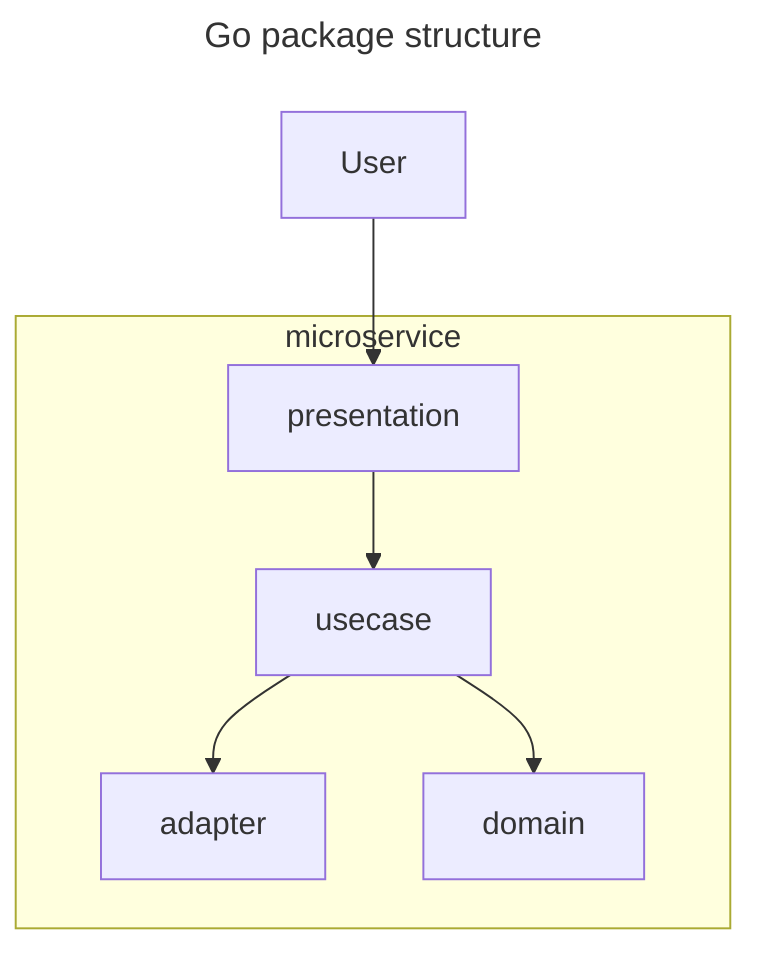

# core

[](http://godoc.org/github.com/alextanhongpin/core)

Useful collection of dependencies required to build microservices.

---

## Packages Overview

### sync/ratelimit
- **GCRA, FixedWindow, SlidingWindow**: High-performance rate limiters with unified metrics collection.
- **MetricsCollector**: Shared interface for atomic and Prometheus-based metrics.
- **Prometheus Integration**: See `sync/ratelimit/examples/` for usage.

### sync/singleflight
- Duplicate suppression for concurrent function calls (like Go's `sync/singleflight`).

### sync/lock
- Distributed and in-memory locking utilities.

### dsync/cache
- Simple in-memory cache with optional expiration and metrics.

### http/auth
- HTTP authentication middlewares (Basic, Bearer, JWT, etc.).

### http/chain
- Middleware chaining for HTTP handlers.

### http/contextkey
- Type-safe context key utilities for HTTP and general use.

### http/handler
- Base handler patterns and test helpers.

### http/pagination
- Cursor-based pagination helpers for APIs.

### metrics
- Metrics helpers and Prometheus integration utilities.

### telemetry
- Telemetry and logging helpers, including Prometheus and slog integration.

### types
- Utilities for common types: assert, email, env, number, random, result, safe, sets, sliceutil, states, structs, etc.

---

## Project structure for Microservice



Other packages

- https://github.com/alextanhongpin/autocomplete
- https://github.com/alextanhongpin/dbtx
- https://github.com/alextanhongpin/errors
- https://github.com/alextanhongpin/money
- https://github.com/alextanhongpin/passwd
- https://github.com/alextanhongpin/passwordless
- https://github.com/alextanhongpin/profane
- https://github.com/alextanhongpin/stringcases
- https://github.com/alextanhongpin/stringdist
- ~https://github.com/alextanhongpin/builder~
- ~https://github.com/alextanhongpin/circuit~
- ~https://github.com/alextanhongpin/clash~
- ~https://github.com/alextanhongpin/constructor~
- ~https://github.com/alextanhongpin/dataloader2~
- ~https://github.com/alextanhongpin/dataloader3~
- ~https://github.com/alextanhongpin/dataloader~
- ~https://github.com/alextanhongpin/getter~
- ~https://github.com/alextanhongpin/goql~
- ~https://github.com/alextanhongpin/mapper~
- ~https://github.com/alextanhongpin/promise~
- ~https://github.com/alextanhongpin/set~
- ~https://github.com/alextanhongpin/transition~
- ~https://github.com/alextanhongpin/typeahead~
```
