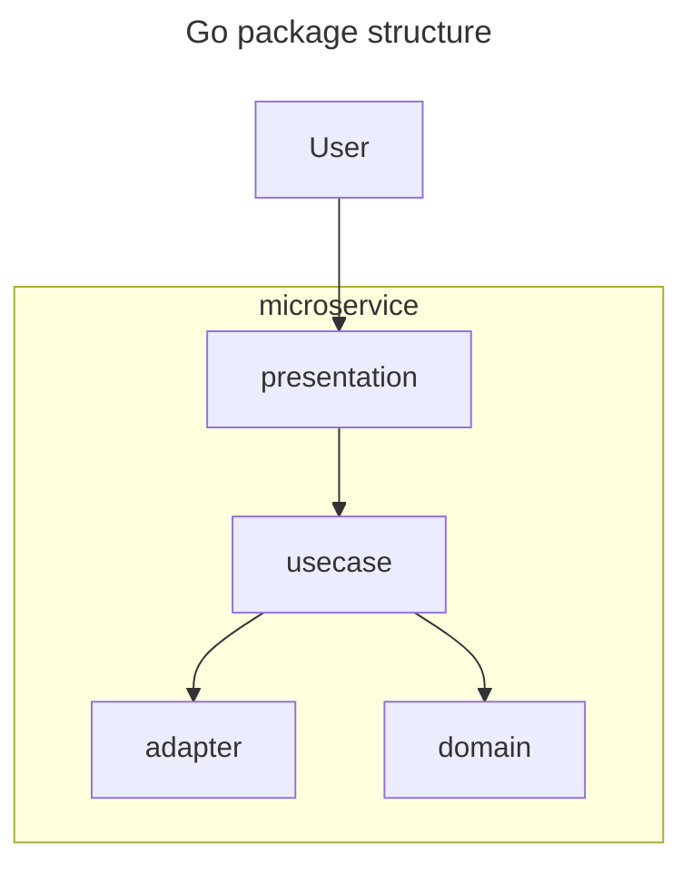

# core

[](http://godoc.org/github.com/alextanhongpin/core)

Go packages for HTTP services, concurrency control, Redis coordination, and typed utilities.

## Installation and documentation

Install the package you need. Modules are released independently, so check the
selected module's `go.mod` for its required Go version.

```sh
go get github.com/alextanhongpin/core/sync/throttle
go doc github.com/alextanhongpin/core/sync/throttle
```

Browse the [Go package reference](https://pkg.go.dev/github.com/alextanhongpin/core)
and the package READMEs below for examples, defaults, errors, and lifecycle rules.

## Quick start: limit concurrent work

Use a throttle to protect a downstream service or connection pool. This program
admits an operation through a limiter; concurrent callers share the same instance.

```go
package main

import (
	"context"
	"log"

	"github.com/alextanhongpin/core/sync/throttle"
)

func main() {
	limiter, err := throttle.New(throttle.Config{Limit: 8})
	if err != nil {
		log.Fatal(err)
	}
	err = limiter.Do(context.Background(), func(ctx context.Context) error {
		log.Println("work admitted")
		return nil
	})
	if err != nil {
		log.Print(err)
	}
}
```

## Choose a package

| Scenario | Package |
| --- | --- |
| Bound concurrent calls and optional backlog | [sync/throttle](sync/throttle/) |
| Retry transient failures with backoff | [sync/retry](sync/retry/) |
| Batch key lookups and share in-flight results | [sync/dataloader](sync/dataloader/) |
| Protect a failing dependency | [sync/circuitbreaker](sync/circuitbreaker/) |
| Enforce per-key quotas within one process | [sync/ratelimit](sync/ratelimit/) |
| Coordinate replicas using Redis | [dsync](dsync/) |
| Transform, filter, or group slices | [types/list](types/list/) |
| Compose internal request handlers | [types/handlers](types/handlers/) |

## Errors and pitfalls

Handle constructor errors before using an instance. `Must` constructors panic on
invalid inputs and are intended for startup wiring. Use `errors.Is` for documented
sentinel errors, since an operation may wrap or join them with backend errors.

In-memory limiters apply to one process. Redis coordination requires a compatible
Redis server and caller-owned client cleanup; circuit breakers and rate limiters
also require `Setup`. Lease-based coordination can allow overlapping work after
expiry or failover. Consult the chosen package's README for these requirements.

Callbacks must honor cancellation. Stop background workers and close owned file
handles when their lifetime ends. Configure retry policies around operations that
are safe to repeat.

---

## Packages Overview

### sync/ratelimit
- **GCRA and FixedWindow**: Concurrent per-key admission with allowance and retry metadata.
- **Adapters**: Function decorators and HTTP middleware for enforcing quotas.

### dsync/singleflight
- Coalesce local calls and coordinate cross-process work with Redis leases.

### dsync/lock
- Token-checked Redis leases with optional renewal.

### dsync/cache
- Typed storage wrappers, file persistence, and Redis cache-fill leases.

### http/auth
- HTTP authentication middlewares (Basic, Bearer, JWT, etc.).

### http/chain
- Middleware chaining for HTTP handlers.

### http/contextkey
- Type-safe context key utilities for HTTP and general use.

### http/handler
- Base handler patterns and test helpers.

### http/pagination
- Cursor-based pagination helpers for APIs.

### metrics
- Metrics helpers and Prometheus integration utilities.

### telemetry
- Telemetry and logging helpers, including Prometheus and slog integration.

### types
- Utilities for common types: assert, email, env, number, random, result, safe, sets, sliceutil, states, structs, etc.

---

## Project structure for Microservice


```mermaid
---
title: Go package structure
---
flowchart
    p0[User]

    subgraph b0[microservice]
        adapter
        presentation
        domain
        usecase
    end

    p0 --> presentation
    presentation --> usecase
    usecase --> adapter & domain
```

Other packages

- https://github.com/alextanhongpin/autocomplete
- https://github.com/alextanhongpin/dbtx
- https://github.com/alextanhongpin/errors
- https://github.com/alextanhongpin/money
- https://github.com/alextanhongpin/passwd
- https://github.com/alextanhongpin/passwordless
- https://github.com/alextanhongpin/profane
- https://github.com/alextanhongpin/stringcases
- https://github.com/alextanhongpin/stringdist
- ~https://github.com/alextanhongpin/builder~
- ~https://github.com/alextanhongpin/circuit~
- ~https://github.com/alextanhongpin/clash~
- ~https://github.com/alextanhongpin/constructor~
- ~https://github.com/alextanhongpin/dataloader2~
- ~https://github.com/alextanhongpin/dataloader3~
- ~https://github.com/alextanhongpin/dataloader~
- ~https://github.com/alextanhongpin/getter~
- ~https://github.com/alextanhongpin/goql~
- ~https://github.com/alextanhongpin/mapper~
- ~https://github.com/alextanhongpin/promise~
- ~https://github.com/alextanhongpin/set~
- ~https://github.com/alextanhongpin/transition~
- ~https://github.com/alextanhongpin/typeahead~
